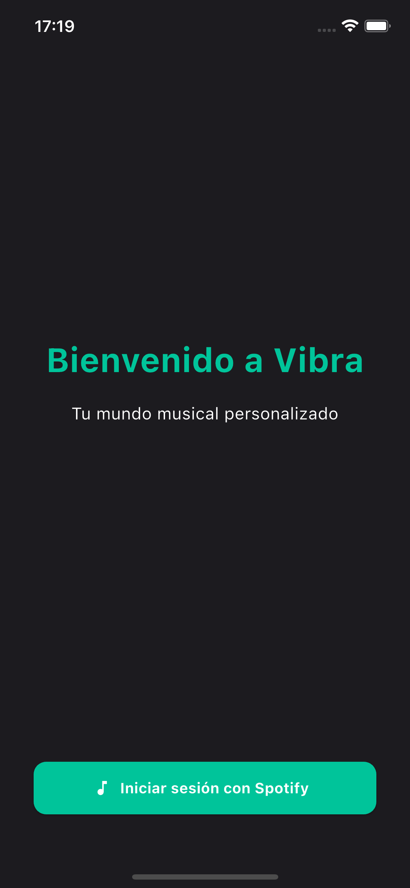
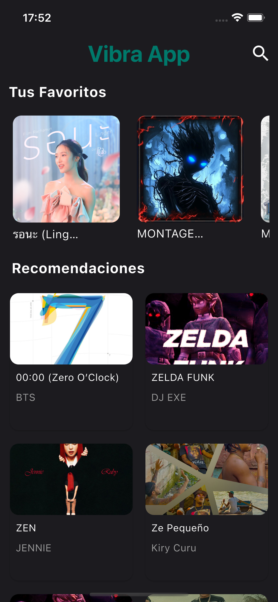
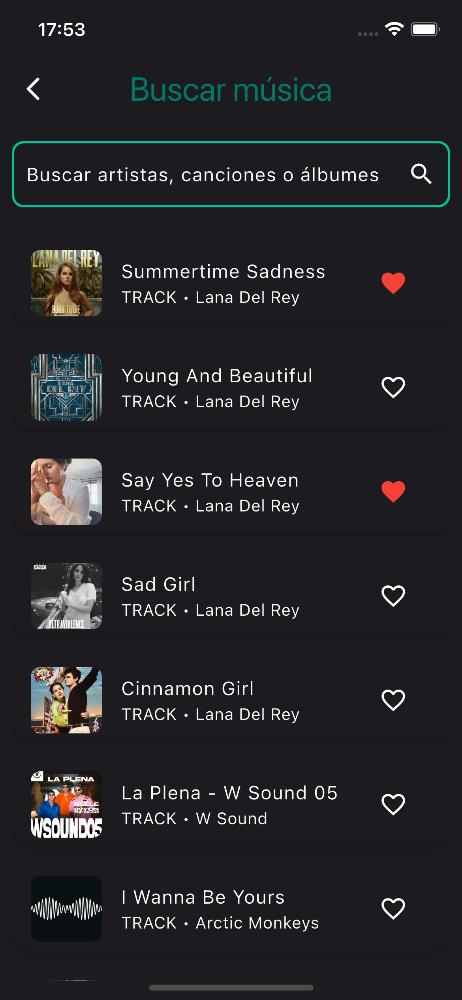
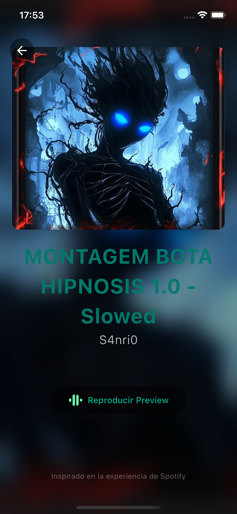
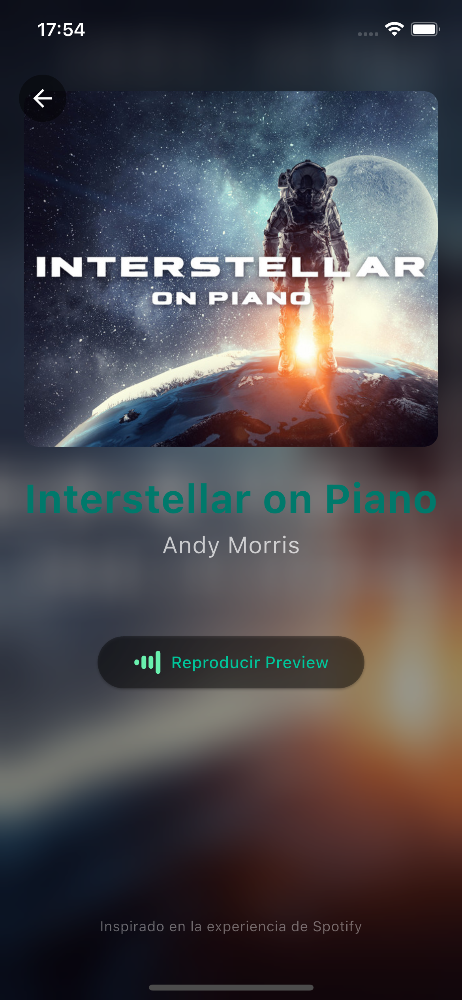

# 🎵 Vibra Music App

## 📋 Tabla de Contenidos
- ✨ Características
- 🛠️ Tecnologías Utilizadas
- 🚀 Instalación y Ejecución
- 📸 Pantallas
  - Lista de canciones favoritas
  - Buscador de canciones
  - Detalle de canción

---

## ✨ Características
- **Listado de canciones favoritas**: Obtiene y muestra las canciones favoritas del usuario desde la API de Spotify.
- **Detalles de canciones**: Visualiza información detallada como título, artista, álbum e imagen.
- **Manejo de token**: Detecta expiración del token y redirige automáticamente al login para renovar sesión.
- **Búsqueda**: Permite buscar canciones, artistas y álbumes.
- **Guardar y eliminar favoritos**: Funcionalidad para marcar y desmarcar canciones como favoritas.
- **Gestión de estado con Riverpod**: Proveedores para manejar datos y estados de forma reactiva.
- **Arquitectura limpia**: Separación clara en capas de presentación, dominio y datos.

---

## 🛠️ Tecnologías Utilizadas
- **Flutter**: Framework para apps móviles multiplataforma.
- **Dart**: Lenguaje principal de desarrollo.
- **Riverpod**: Gestión de estado reactiva y escalable.
- **http**: Cliente para llamadas REST a la API de Spotify.
- **Secure Storage**: Almacenamiento seguro para tokens.
- **Freezed** (opcional): Para manejo eficiente de modelos de datos.

---

## 🚀 Instalación y Ejecución

### Clonar el repositorio

```bash
git clone https://github.com/tu_usuario/vibra_music_app.git
cd vibra_music_app
```

## Instalar dependencias
### Asegúrate de tener Flutter instalado. Luego ejecuta:

```bash
flutter pub get
```

## Generar código (si usas Freezed o build_runner)

```bash
flutter pub run build_runner build --delete-conflicting-outputs
```

## Ejecutar la aplicación
## Para correr en un dispositivo/emulador conectado:

```bash
flutter run
```


## 📸 Capturas de pantalla

- **Inicio de sesión:**  
  <div style="display: flex; gap: 10px;">
   
  </div>

- **Lista de canciones favoritas:**  
  <div style="display: flex; gap: 10px;">
   
  </div>

- **Buscador**
   <div style="display: flex; gap: 10px;">
   
   </div>

- **Detalle de canción:**  
  <div style="display: flex; gap: 10px;">
   
   
</div>


